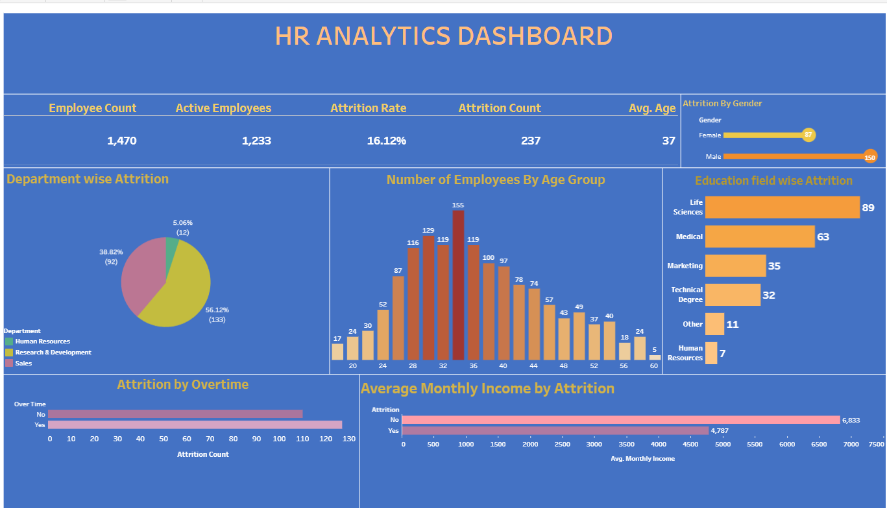

# HR Analytics Dashboard

## About the Project

I created this HR Analytics Dashboard in Tableau to explore employee attrition trends and better understand workforce demographics. The aim of this project was to transform HR data into meaningful insights that can help organizations identify factors influencing employee turnover and make informed HR decisions.

Using Tableau, I built an interactive dashboard that highlights key metrics such as employee count, attrition rate, age distribution, income patterns, and the impact of overtime on attrition.

## Live Dashboard

🔗 Tableau Public Dashboard

https://public.tableau.com/app/profile/abirami.n1460/viz/HRAnalyticsDashboard_17817642066000/AnalyticsDashboard

## Tools & Technologies

- Tableau
- Excel / CSV Dataset
- Data Cleaning
- Data Visualization
- Dashboard Design

## Dashboard Highlights

The dashboard provides insights into:

- Total Employees
- Active Employees
- Attrition Count
- Attrition Rate
- Average Employee Age
- Department-wise Attrition
- Education Field-wise Attrition
- Attrition by Gender
- Attrition by Overtime
- Employee Age Distribution
- Average Monthly Income Analysis

## Key Findings

After analyzing the dataset, a few interesting patterns emerged:

- The overall employee attrition rate is **16.12%**.
- Research & Development accounts for the highest number of employee exits.
- Employees between **30 and 35 years** represent a large portion of the workforce.
- Attrition is noticeably higher among employees who work overtime.
- Employees who left the company tend to have a lower average monthly income than those who stayed.
- Life Sciences and Medical backgrounds show the highest attrition counts.

## Business Value

This dashboard can help HR teams:

- Monitor employee turnover trends
- Identify departments with higher attrition
- Understand workforce demographics
- Support retention and engagement strategies
- Make data-driven HR decisions

## Dashboard Preview

## What I Learned

Through this project, I gained hands-on experience in:

- Building interactive Tableau dashboards
- Designing KPI-driven visualizations
- Analyzing HR datasets
- Creating business-focused insights from data
- Presenting findings through data storytelling
